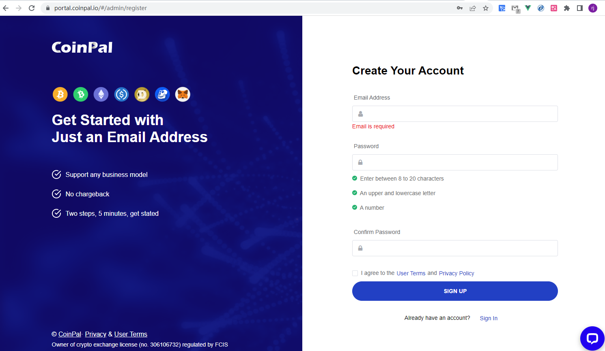
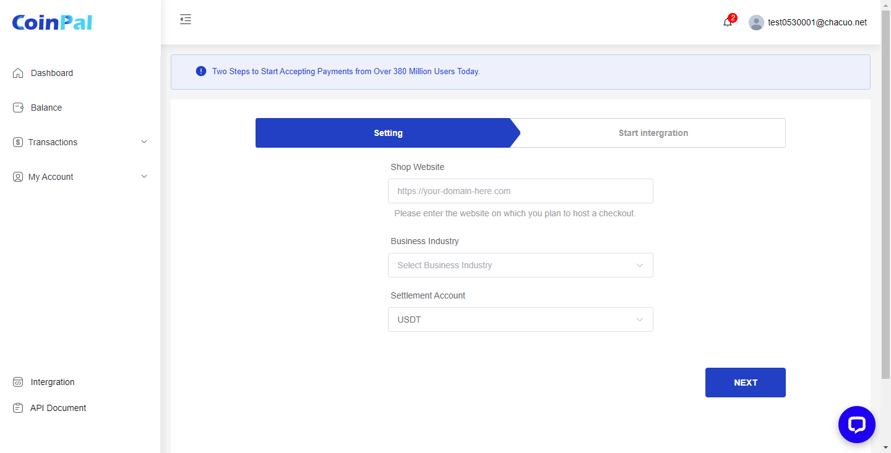
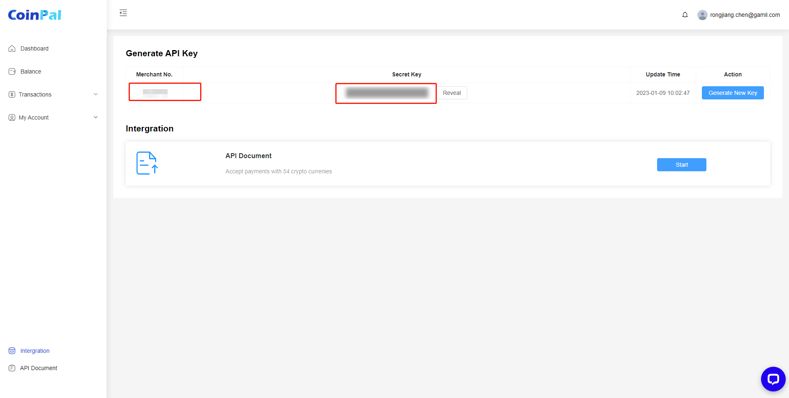
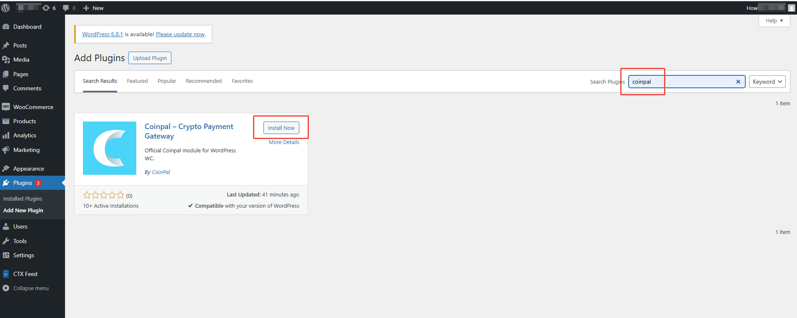
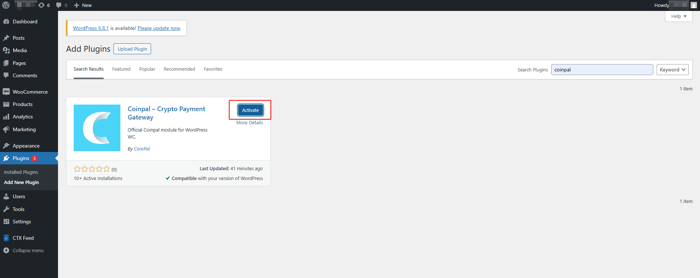
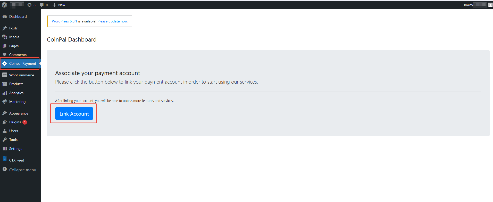
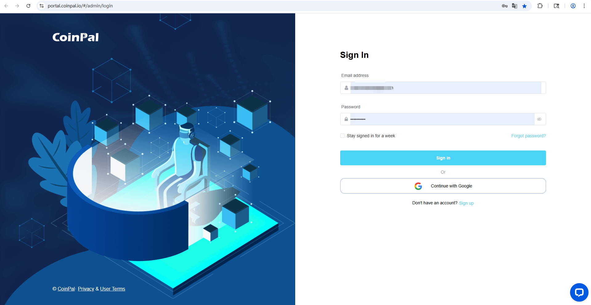
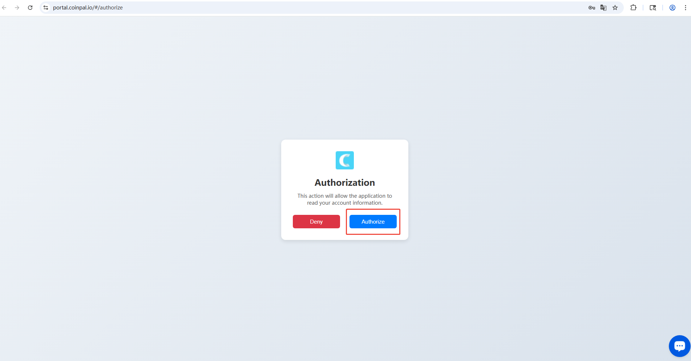
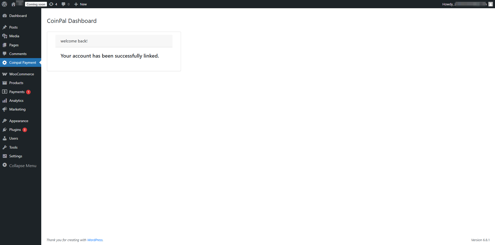
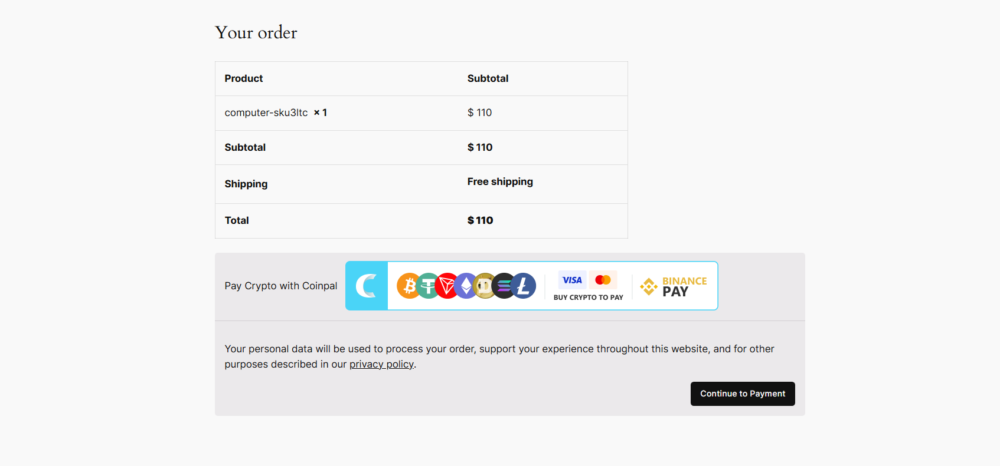

# WooCommerce Coinpal Checkout Installation

## Step 1: Log in to the Coinpal Admin Dashboard to get the Merchant Number and Secret Key.
1. [Register](https://portal.coinpal.io/#/admin/register)/[login](https://portal.coinpal.io/#/admin/login) and go to Coinpal's Admin Dashboard 

2. Follow the Dashboard guidelines to fill in the relevant information

3. Click the 'Integration' button in the lower left corner to get the corresponding Merchant Id and Secret Key

## Step 2: Installing the CoinPal Plugin on your Wordpress Site.

1.  Install "Coinpal Payment Gateway" plugin

    Log in to your WordPress admin dashboard.
      
    From the left-hand menu, go to Plugins → Add New.
    
    In the search bar at the top right, type "Coinpal Payment Gateway".
    
    Once the plugin appears in the search results, click "Install Now".
    
    After the installation is complete, click "Activate" to enable the plugin.
    

2.  Activate the Coinpal WooCommerce Gateway

    Navigate to your WordPress admin dashboard.
    
    Go to Coinpal Payment → Related accounts.
    
    Click the "Sign In" button to begin the authorization process.
    
    In the popup window, click "Authorize" to link your Coinpal account.
    
    Upon successful authorization, you will see the confirmation message: "Your account has been successfully linked."
    

## Step 3: Testing your Coinpal WooCommerce Integration.

To confirm your Integration is properly working create a test order:

Add a test item to your shopping cart and view the cart.

Proceed to Checkout

Select Coinpal as the Payment Method.

Click Place Order

Click the “Continue to Payment” button.

Verify all of the Wallet Addresses and Order info, and make sure the Validation Tests all have a Green Check Mark.

If you like you can now proceed to making a test payment.

## Step 4: Marking a Payment as Received on WooCommerce.

Login to your Wordpress Admin Dashboard.

Go to the WooCommerce Section and Click Orders.

You will see the test orders marked as “Paid”.

Check whether coins are settled to the CoinPal wallet.

You may also use a Block Explorer to verify if the transaction was processed.

After the verification of the above steps is completed, it means that the connection with Coinpal is successful.

